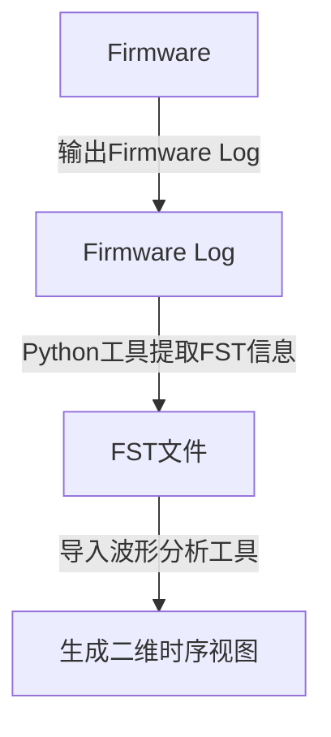
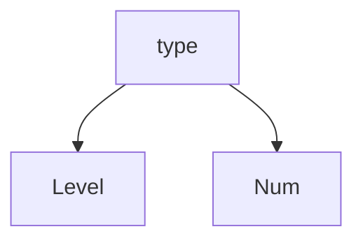
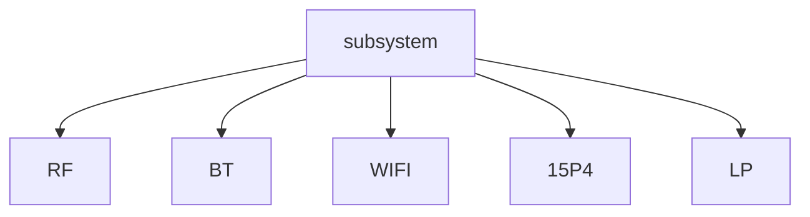
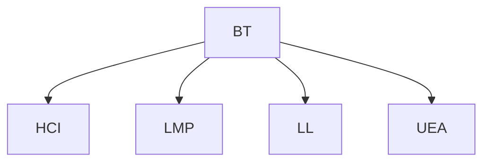
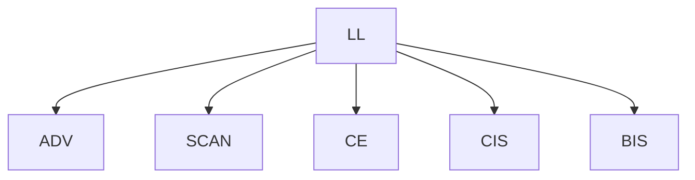
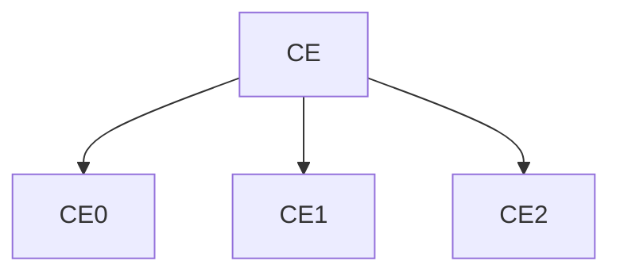
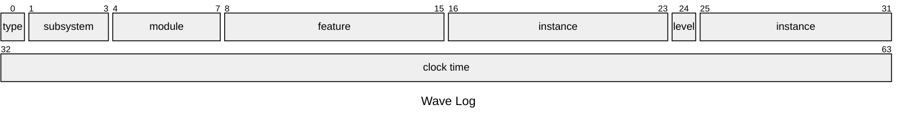
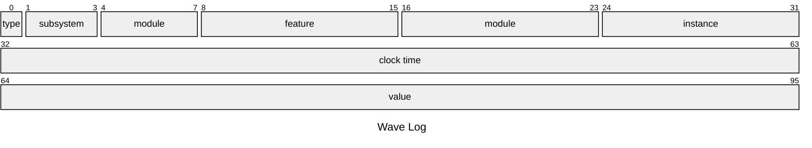
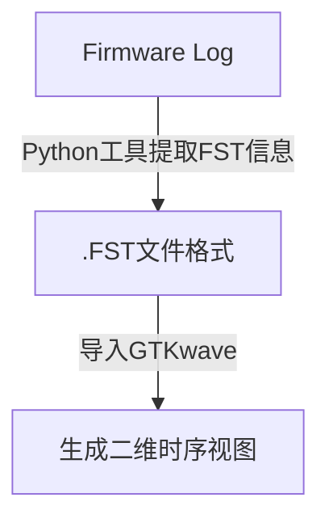
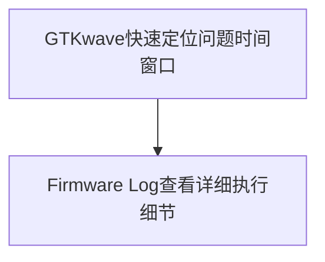

%%这个文档要解决的问题

一句话总结

引入波形分析工具 使用二维时序视图增强(替代)现有AML BT 文本式的问题分析方式，以提高研发分析问题的效率/准确率

1. 背景
2. 目标
3. 方案
4. 实施步骤
5. 预期收益
6. AML Firmware Lof未来发展方向%%


# 1-背景

## 1.1 AML Firmware Log现状

当前AML BT团队分析问题的主要方式是Firmware Log，主要依靠上位机和IC约定好日志输出格式，IC通过Debug UART输出日志，上位机完成日志解析，研发人员通过文本式Log进行问题分析与定位。


## 1.2 AML Firmware Log存在的问题

AML BT Firmware Log通过多年实践验证，在功能开发和问题定位场景中发挥了重要作用。然而随着Bluetooth协议栈复杂度提升，以及多链路共存，LE Audio，Coexist等复杂场景的引入，文本式日志方案逐渐暴露出其局限性。

### 1.2.1 日志分析效率低

现有问题分析主要依赖研发人员对日志进行关键字搜索、条件过滤及上下文阅读，以手动还原系统运行过程。面对复杂问题时，研发往往需要在大量日志中反复检索、跳转和关联不同模块的信息，逐步构建完整的问题上下文。随着日志规模和系统复杂度的增加，分析过程耗时较长，且较难快速聚焦关键事件。
### 1.2.2 多模块关联分析困难

系统运行过程通常涉及调度、LL、LMP、HCI等多个模块，但相关日志分散在大量文本信息中。研发人员需要手动关联不同模块的日志记录，分析事件间的时序关系和交互逻辑。对于多模块、多链路、协议共存等复杂场景，文本日志难以直观反映模块间的协作过程，研发往往需要在海量日志中反复检索和交叉验证，才能逐步还原系统运行流程及问题发生的上下文。

### 1.2.3 缺乏直观的时序视图

Bluetooth Controller本质上是一个时序驱动系统。无论是LL协议流程、HCI交互还是RF行为分析，本质都依赖于对事件时序关系的准确理解。然而，文本日志主要用于记录离散事件，难以直观呈现事件间的时间关系和交互过程。研发人员往往需要结合大量上下文信息，通过人工关联和推导的方式重建系统运行轨迹。随着问题复杂度提升，所需关注的事件和上下文信息不断增加，导致分析成本显著上升，研发容易陷入海量日志的检索、关联与验证过程之中。

### 1.2.4 UART带宽天然受限

当前 Firmware Log 主要依赖 Debug UART 输出，其带宽能力存在天然上限。随着系统复杂度和日志规模持续增长，日志输出量不断增加，未来可能逐步接近甚至超过 UART 的实际承载能力。在高负载场景下，容易出现日志丢失、关键事件缺失以及时序信息失真等问题，从而影响问题定位的完整性和准确性。

### 1.2.5 上手曲线陡峭

当前日志分析高度依赖研发人员对系统架构、业务流程及日志内容的长期积累。研发需要通过大量实践逐步建立对日志含义、模块交互关系及典型问题模式的理解，学习周期较长。对于新人而言，往往难以快速掌握有效的问题分析方法，导致培养成本较高，不利于知识沉淀、经验传承及团队整体研发效率提升。


# 2-目标

Firmware Log可视化升级方案旨在解决传统文本式Firmware Log在时序分析、多模块关联及问题定位效率等方面的不足。

方案基于**开源波形分析工具**，在保持现有Firmware Log体系兼容性的前提下，引入面向时序分析的可视化日志能力，将Controller运行过程**从线性文本展示升级为二维时序视图展示**。

通过将离散事件转化为统一的时序表达，增强系统运行过程的可观测性，帮助研发人员更高效地理解模块间交互关系、还原问题发生过程、提升问题定位效率和分析准确性。

本方案遵循兼容现有Log体系、低侵入性及渐进式演进的原则，实现日志分析能力升级。


# 3-方案

本章节详细描述如何将文本式AML Firmware Log升级为可视化的二维时序视图。

## 3.1 方案概述

Firmware Lof升级方案初期旨在保持现有 Firmware Log 体系兼容的前提下，引入面向时序分析的可视化日志能力，平滑切入现有的Firmware Log架构。

通过定义独立于现有日志体系的 Wave Log，将关键调度事件、状态切换及模块交互信息以结构化形式记录。Offline 分析阶段利用解析工具提取 Wave Log，并转换为波形分析工具支持的 FST 文件，最终通过波形分析工具展示为二维时序视图，实现对 Controller 运行过程的可视化分析。



## 3.2 Wave Log格式定义

Wave Log作为文本式 Firmware Log 向图形化 Firmware Log 演进的中间载体，在保留现有日志体系兼容性的前提下，为后续时序波形生成提供统一的数据基础。

## 3.2.1 Wave Log设计原则：

1. **兼容现有日志体系**
    基于现有 Firmware Log 机制进行扩展，新定义 Wave Log，不影响现有日志输出、日志解析及问题定位流程，为开发人员提供平滑过渡
2. **满足可视化分析需求**
	支持多个模块、多个场景、多种日志类型的统一描述，能够完整表达模块状态变化、事件触发、消息交互以及时序关系，为二维时序视图生成提供基础数据。
3. **精简高效，节省带宽资源**
    Wave Log仅保留时序分析所需的关键字段，避免冗余信息输出，在保证分析能力的同时尽可能降低Debug UART带宽占用。
4. **结构统一，便于工具解析**
    采用固定格式定义，降低日志解析复杂度，提高工具链自动化处理能力，为后续FST波形生成提供稳定输入。
5. **可扩展性良好**
    支持新增模块、新增事件类型以及新增展示形式，未来能够随着Controller功能演进持续扩展，而无需频繁修改工具链框架。

### 3.2.2 层级结构

总体层级采用五级树形结构组织，用于描述时序信号在系统中的逻辑归属关系，同时直接映射到波形工具中的层级展示结构。

- **type** 
	- **subsystem** 
		- **module**
			- **feature** 
				- **instance**

各层级定义如下

**1) type - 日志展示类型**

用于定义波形工具中的展示形式，决定日志最终以逻辑电平、数值信息或其他形式进行呈现。



**2) subsystem - 功能域划分**

用于描述系统级功能域，将不同子系统的日志进行隔离，形成顶层分类。



**3) module - 协议模块划分**

用于描述子系统内部的主要功能模块。

以BT子系统为例(其他系统可以由模块owner自行扩充)



**4) feature - 具体功能场景**

用于描述模块内部的具体功能单元或业务场景。

以LL模块为例



**5) instance - 运行实例**

用于区分同一Feature下的多个独立运行对象。

当系统同时存在多个连接、多组广播或多个任务实例时，可通过Instance对其进行区分。

以LE CE为例




### 3.2.3 log格式定义

按照层级结构定义和log类型，wave格式的Firmware Log按照如下定义

#### 3.2.3.1 电平类(电平高和低，适合展示状态/任务的起始和结束)



#### 3.2.3.2 数值类(word类型，适合展示详细数据)





## 3-3 Firmware Log Tool的改造

## 3-4 示例


# 实施步骤


# 预期收益


# AML Firmware Log未来发展方向


# 2-目标


Firmware Log可视化升级方案意在解决传统文本式Firmware Log在时序分析，多模块关联，分析效率低等方面的不足。

方案基于开源波形分析工具**GTKwave**,在保证现有Firmware Log体系兼容性的前提下，引入面向时序分析的可视化日志能力，将Controller运行过程从传统的线性文本展示升级为二维时序视图展示。

通过模拟图示例来展示从Firmware Log到二维时序图示的具体效果

原始日志


```bash
[000000 us] HCI_CMD opcode=0x200C cmd1  
[001000 us] LE_SCAN START  
[002000 us] LE_CE_START ce_counter=11  
[003000 us] LE_SCAN END  
[006000 us] BR_SNIFF ENTER  
[009000 us] BR_SNIFF EXIT  
[012000 us] LE_SCAN START  
[015000 us] LE_SCAN END  
[018000 us] LE_CE_START ce_counter=12  
[021000 us] LE_SCAN START  
[026000 us] LE_SCAN END  
[028000 us] HCI_EVENT event_code=0x0E event1  
[030000 us] HCI_CMD opcode=0x2013 cmd2  
[033000 us] BR_SNIFF ENTER  
[036000 us] BR_SNIFF EXIT  
[038000 us] LE_CE_START ce_counter=14  
[040000 us] HCI_EVENT event_code=0x3E event2  
[042000 us] HCI_CMD opcode=0x2022 cmd3  
[046000 us] HCI_EVENT event_code=0x0F event3  
```

升级后的二维时序视图

![[analog_shedule_diagram.drawio]]

### 1.2.1波形分析工具GTKwave简介

### 1.2.2


## 1.3实施计划


整体工作将分为三个阶段完成，以降低导入风险，保证团队平滑过渡。

### 1.3.1 第一阶段 - 增量融入

在不改变现有研发习惯的前提下，验证GTKwave方案的可行性和实际收益，让研发人员逐步建立起对这套方案效率提升的直观感受。

具体方式为，在Firmware Log中新定义一种新的Log格式，称之为**FST信息**,Firmware Log在生成之后，通过Python工具提取FST信息，送入GTKwave工具生成二维时序信息，如下图


### 1.3.2 第二阶段 - 双向适配

逐步推动各模块逐步补充GTKwave信号定义，例如
1) 状态信息
2) 时序信息
3) RF信息
4) HCI信息
5) 内存管理信息
6) 共存信息

同时对现有文本日志进行梳理,包括
1) 删除冗余调试日志
2) 减少重复打印
3) 保留关键Log

### 1.3.3 第三阶段 - 体系收敛(方案完成)

根据团队实际使用情况，确定未来Firmware Log最终形态。

预计会收敛到以下两种模式之一

#### 1.3.3.1 方案A: GTKwave模式

现有的Firmware Log完全适配GTKwave，旧的Firmware Log Tool删除，日志生成直接送入Python转换成FST文件格式，送入GTKwave解析。
 
#### 1.3.3.2 方案B: 组合分析模式

GTKwave负责建立全局时序地图，文本式log负责详细上下文分析，问题分析时，遵循以下流程




# 3.总体方案

## 3.1方案介绍

## 3.2核心思想

# 4.技术设计

## 4.1Log抽象模型

## 4.2时间轴设计

## 4.3 Signal设计

## 4.4 FST生成

## 4.5 GTKwave展示

# 5.典型案例

# 6.效果评估

# 7.实施计划

# 8.风险评估

# 9.总结

