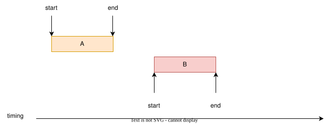
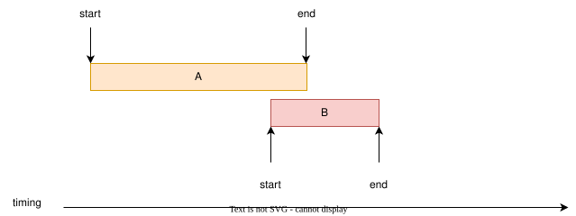
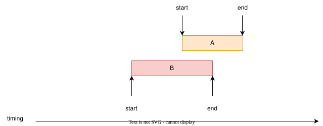
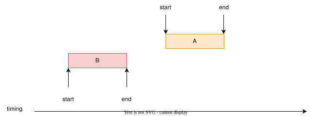
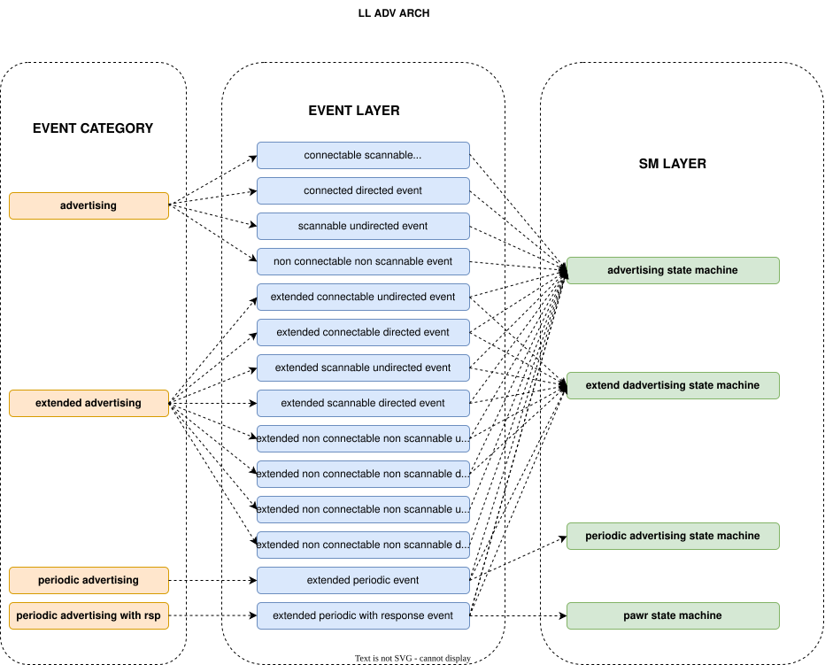
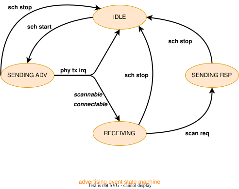

# HTX-低功耗蓝牙协议栈
## 写在前面
人生如此精彩，每天都能够一直体验新事物是无疑是一件很幸福的事情，做技术也是如此，重复性的工作总是使人怠惰，每天都充满挑战才会让人过的精彩，让生活充满乐趣。

低功耗蓝牙这项技术，截至目前为止，从事四年时间有余，开发这个BLE Controller算是对这些年自己的所学做一个总结记录(或许我以后不再从事这个领域，也算是对自己这些年的努力有个交代，不留遗憾)，又算是一种让自己温故知新的一种方式，若干年后，等到自己老了，再回顾过往，能感到年华没有虚度，再回味过往精彩的日子，那可真令人怀念。

在这四年，我经历过做项目，过认证，出SDK，干杂活出身，但庆幸的是，抓住了所有可能的机会，对技术从入门到熟悉再到如数家珍，度过的很快。这些年的经历让自己很有感触，努力做好每一件事，无论事情是大是小，你都需要有自己的思考，思考原理，架构，用途，发展方向，细节实现，或许过程会很艰辛，但只要你坚持到最后，你一定会感到很有趣的。

## 我对软件迭代和更新的理解

细数几千年来中国的发展过程，大到王朝更迭、改天换地，小到农器改良、文字演变，世间万物皆在变化中向前。那些固步自封、不求进取的思想和制度早已淹没在时代发展的浪潮里。历史反复证明：改革是国家存续的根基，更新是社会进步的动力，求变是个体突破的密钥，若不能从变化中汲取生命力，注定会被时光的洪流湮没。

同理，我认为软件的发展亦是如此。

迭代和更新是痛苦的，你要不停的否定之前的自己，并要在其间找到新的方向，实现新的架构，但优秀来自于不满足，不将就，不甘心。迭代和更新正是软件的生命力所在，没有一份代码是完美的，但代码可以在迭代更新种不断完善，逐步在深度和广度，效率和空间，扩展性和普适性之间取得平衡，变得更加高效，更加稳定，更加易用。

## 我对BLE协议的理解
BLE是一种短距离无线通信方式，它的子协议有很多，像是广播，连接，音频，测距等。这些子协议都可以分成 形式+数据来理解。

形式就是数据传输的方式，数据传输的频率，速率，物理承载特性，传输时间，等等因素组成了数据传输的方式。

数据形式取决于具体场景，可以分为指令，协议数据，音频数据等。

我把对BLE Controller的实现分为几部分，基础模块包括时序调度，时序规划。协议包括HCI,PHY,LL等。其中LL又包含广播，扫描等部分，如下图

## 协议栈框架

协议栈实现了标准的Bluetooth HCI和BLE Controller

Bluetooth HCI具有较强的框架性，整体代码精简，实现清晰高效，占用空间较小，具有较强的可扩展性和可移植性。

Bluetooth LL支持多状态机的实现，支持多状态的自由组合，在时序和频带允许的情况下不受限制。

### HCI

### LL

## 自适应跳频算法

### 跳频算法1

跳频算法1只适用于连接事件

跳频算法1的实现分为两个阶段，分别是

- unmapped channel index的计算
- 从used channel中映射使用的数据信道的channel

### 跳频算法2

## 时序调度部分

时序调度主要分两部分，分别是时序调度和时序规划。

- **时序调度**

时序调度的核心目标是确保系统内所有任务均能在规定时限内执行。对于 BLE 协议栈而言，自 Core 5.0 版本起，对多状态机实例的支持需求显著增强，这就要求系统具备多任务共存能力 —— 例如同时支持两个 ACL 从机（Peripheral）或多个 ACL 主机（Central），由此催生了对时序调度模块的硬性需求。

从本质上讲，时序调度是对时间资源与射频带宽的高效统筹。一套优秀的时序调度系统，不仅能满足多任务并行运行的需求，还能最大限度降低自身资源消耗（包括算力与存储空间）。

- **时序规划**

时序规划的核心目标是：针对系统内锚点可变的周期性任务，通过统筹协调确保任务间互不冲突，从而提升系统整体的任务执行效率。

时序规划分为静态规划和动态规划两类：

静态规划适用于时序固定的周期性任务，如 BLE 协议中的 ACL、CIS、BIS、PDA 等。这类任务的特征是：一旦初始锚点、执行间隔及任务时长确定后，其后续时序便保持固定，不再发生变更。

动态时序规划则适用于时序非固定的周期性任务，例如 BLE 协议中的 ADV（广播）和 EXT ADV（扩展广播）。这类任务虽具有周期性，但每次执行的锚点可灵活调整，能根据系统当前的时序状态和带宽资源进行动态适配。

### 时序调度

时序调度模块将任务分为三类，分别是

- periodic task:周期性任务，在任务开始之后，会按照一定周期持续执行
- sporadic task：突发性任务，只执行一次
- asap task：As soon as possible，尽可能占用带宽类型的任务。

时序调度模块不存储任何信息，一个任务如果要使用时序调度模块，需要首先抽象出时序节点(参考下述实现)，然后调用时序调度模块的API将该任务抽象出的时序节点送入时序调度模块，如果当前存在的时序节点非空，时序调度模块就会开始按照时间顺序执行待调度任务。

时序调度模块对实时性要求较高，因此实现依赖硬件timer,通过调用硬件timer来精准的掌控模块内任务的执行。**时序调度模块需要使用hal层的timer模块**

时序调度模块将每个任务虚拟成一个节点，该节点具有下述特性(简述)

- anchor point：任务执行的锚点，对于周期性任务，其锚点会周期性变化
- interval：周期性任务的执行间隔，非周期性任务该值无意义
- duration：任务执行时间，指的是从锚点开始到任务执行结束的时间。
- start latency：任务从准备到开始执行的时间，在锚点之前。
- stop latency：任务执行结束后的收尾时间，在anchor point + duration之后的时间。
- callback：任务调度执行回调，时序调度模块通过回调来通知任务开始执行，结束执行，任务执行时间错过，或者任务被取消等。
- priority：任务优先级，如果多个任务执行时间有折叠，时序调度模块会优先执行高优先级的任务。

假设当前存在两个任务A和B，时序调度模块将任务之间的相对关系分为以下六种

**case A:** A开始与B之前，A结束于B之前(start before end before)

这种情况任务A和任务B之间完全没有冲突，任务A可能和其他任务冲突。

**case B:** A开始于B之前，A结束于B之间(start before end during)

这种情况任务A和任务B冲突，任务A可能在任务的前半部份和其他任务冲突。

**case C:** A开始与B之前，A结束于B之后(start before end after)

这种情况任务A和任务B冲突，任务A的前半部份可能和其他任务冲突，任务A的后半部份也可能和其他任务冲突

**case D:** A开始与B之间，A结束于B之间(start during end during)

这种情况任务A和任务B冲突，任务A不会和其他任务冲突

**case E:** A开始于B之间，A结束于B之后(start during end after)

这种情况任务A和任务B冲突，任务A的后半部份可能和其他任务冲突。

**case F:** A开始于B之后，A结束于B之后(start after end after)

这种情况任务A和任务B完全不冲突，但任务A可能和其他任务冲突。

时序调度模块共有三个任务链表，分别是

- waiting list:待调度任务链表。
- running list：正在执行的任务链表(用节点来描述更准确)。
- canceled list：因为任务冲突被取消的任务链表，后续由于其他任务提前结束仍然可能被执行到。

这三个任务链表中的任务数量之和就是当前时序调度模块中的任务总数。

#### 任务调度

时序调度模块通过以下步骤调度任务、

1. 将待添加任务虚拟成时序节点，填充anchor point,interval,duration等特性
2. 调用时序调度模块API,尝试任务添加到时序调度模块的waiting list里面。
    - 如果任务不和已有任务冲突，或者和已有任务冲突但优先级较高，则任务成功插入待调度任务链表waiting list。
    - 如果任务和已有任务冲突且优先级较低，插入到canceled list，等待后续调度机会(如果其他任务提前结束，canceled list任务还是有可能被执行的)。
3. 时序调度模块按照时间顺序依次调度waiting list中的任务，waiting list任务执行到时，时序调度模块将任务从waiting list取出，插入running list中去。
4. 时序调度模块执行running list首节点的task start callback，任务执行开始。同时，时序调度模块设置timer,待当前任务结束时间点到达，执行running list首节点的task end callback,任务调度执行结束。
5. 时序调度模块继续调度waiting list中的下一个任务，依次滚动执行。
6. 系统在提取waiting list中的下一个任务执行时，首先查看canceled list任务，如果canceled list中的首结点任务不和waiting list首节点任务冲突，且结束时间位于waiting list首节点之前，则时序调度模块提取canceled li st首节点执行。

   

### 时序规划

#### 静态时序规划

#### 动态时序规划

## BLE HCI

## BLE Controller

### BLE Phy

### BLE Packet

### LL

#### LL PACKET

#####  Packet send and receive

###### 公共收发地址

LL为每个实例提供了公共的PHY收发地址，在以下情况推荐使用、
- 每一轮PHY收发，PACKET很少变化
例如ADV,SCAN,PDA等

###### 私有收发地址

LL Module内部可以自己准备PHY收发地址，在以下情况使用，
- 每一轮收发，PACKET基本都不一样
例如CONN,CIS,BIS等

#### LL Control

LL Control Procedure要点
- ACL Terminate Procedure可以在任意时刻发起，不受到当前进行的LL Control Procedure影响
- 对于除了ACL Terminate Procedure之外的其他所有LL Control Procedure，每个设备每个连接在在当前时刻只能有一个LL Control Procedure在处理，
- 一个设备可以在等待相应对端设备的LL Control Procedure时，自己再发起一个LL Control Procedure。
- 在进入Connect之前，不得发起任何LL Control Procedure
- 除非另有说明，LL Control Procedure之间没有顺序的限制
- LL Control PDUs和LL Data PDU之间的发送优先级顺序是由厂商实现决定的，Host不能认为断连时，发送的数据被在断连之前被发送出去。
- 带Instant的Procedure，例如LL Connection Update Procedure或者LL Channel Map Update Procedure，如果超过了Instant点，LL Control PDU还没有得到ACK，那么主机和从机应该认为当前连接丢失。应该退出Connection State，回到Standby状态
##### LL Control Collisions
BLE ACL LL Control Procedure Collisions的情况
    下面几种情况的procedure不兼容
    - 两个带有instant的procedure
    - 两个CS Configuration procedure
    - 两个CS Repeat Termination procudure
    - 一个procudure是Frame Space Update Procedure，另一个Procedure是Frame Space Update Procedure或者是Connected Isochronous Stream
      Creation procedure
遇到冲突的procudure需要采取措施，原则是:设备不应该在一个不兼容的procedure未完成时，启动另一个procedure。
意外情况的处理
(1)Central启动了不兼容的Procedure A，同时收到了Peripheral启动的Procedure B
   - 如果peripheral是在对Procedure A有过回复之后启动的Procedure B，那么Central应该立即断开
   - 如果Peripheral是在还没回复Procedure A的时候启动的Procedure B，那么Central应该拒绝Procedure B
(2)如果Peripheral启动了不兼容的Procedure A，同时收到了Central启动的Procedure B
   - 此时Peripheral应该忽略自己启动的Procedure A，不再有任何动作，转而去处理Central启动的Procedure B,以Central启动的流程为主。

Host应该知道当前因为LL Control Procedure Collisions导致的设备断连原因
(1)如果Procedure A和Procedure B是一样的procedure
(2)如果Procedure A是Connection Update procedure，Procedure B是Connection Parameters Request procedure

待处理事项，
(1)synchronization state的定义
(2)BLE完整state定义，包括广播，扫描，连接，扩展广播，周期性广播之类的
(3)传统广播和扩展广播的兼容
#### BLE Standby

#### BLE Advertising

截至Core Specification v6.0,BLE Advertising 可以分为两大类,分别是BLE Advertising和BLE Extended Advertising

BLE Advertising 架构为

##### BLE Advertising 
BLE广播有四种类型的广播事件，分别是

|ADV Type       | Connectable | Scannable | 
|:-------:      |:-----------:|:---------:|
|ADV_IND        |Y            |Y          |
|ADV_DIR_IND    |Y            |N          |
|ADV_SCAN_IND   |N            |Y          |
|ADV_NONCONN_IND|N            |N          |

其中，ADV_DIR_IND又分为
 - high duty cycle directed advertising：常用于回连
 - low duty cycle directed advertising

将四种基础广播抽象，设计一个基础广播状态机模型，以是否可连接，是否可扫描作为上下文context,来区分四种广播类型的处理

其中，四种广播类型走的通路为

##### BLE Extended Advertising
   

#### BLE Connection

##### BLE Central
##### BLE Peripheral

#### BLE Scanning

#### BLE Initiating

#### BLE Synchronization

#### BLE Broadcasting

###

(1)新平台适配
   Ⅰ  SDK新平台调试，启动文件适配优化
   Ⅱ  基础模块功能调试/适配层填充，如PM(低功耗),RF(射频),Timer，Codec(音频)等
   Ⅲ 功耗优化，性能评估，如供电配置优化，射频性能测试评估，
   Ⅳ SDK模块验证(BLE)，如LE ADV/ACL/BIS/CIS等
   Ⅴ  多核架构设计/适配，多核通信机制优化
      如mailbox/share memory设计优化等

BTBLE Audio双模Audio SDK LE部分
(0)LE 协议栈开发和维护
   Ⅰ  legacy adv,extended adv,periodic adv,primary scan,secondary scan
   Ⅱ  Multiple BLE ACL Slave/Master
   Ⅲ BLE CIS/BIS 
   Ⅳ HID Over ISO，SCI，iso parameter update等

相关项目
某会议系统（主从）
hid over iso游戏手柄

(3)ACCESS任务设计和优化
   Ⅰ   BT Page/Page Scan+BT Inquiry/Inquiry Scan + LE Scan + 私有链路Scan
   Ⅱ  带宽集中模式和带宽分散模式
   Ⅲ 优先级模式(时间统计)
(2)BT ACL Slave+LE ACL Slave + LE ADV + BT ESCO混合时序设计 - 适用于BTBLE Headset场景项目
   Ⅰ  LE ADV + BT ACCESS
   Ⅱ  LE ADV + BT Slave
   Ⅲ LE ADV + BT ESCO
   Ⅳ LE ACL Slave + 
(3)BT ACL Master + LE ACL Master + BT ESCO混合场景时序设计 - 适用于BTBLE Audio Dongle场景项目
   Ⅰ  BT ACL Master + multiple LE ACL Master 
   Ⅱ BT ESCO + multiple LE ACL Master 

项目 多模游戏手柄转换器

(4)BT A2DP TO LE BIS方案设计和优化
   Ⅰ  核心时序设计
   Ⅱ 本地+远端多设备同步播放
项目 音箱

(5)多模块(BT/LE/私有链路)通信机制
   Ⅰ 信息注册
   Ⅱ 信息查询
   Ⅲ 信息通知

(7)多主动任务共存模块设计
   Ⅰ offset+shift双维度时序规划
   Ⅱ应用于多个量产项目

(8)ACL with BIS/CIS时序共存
   Ⅰ BIS/CIS任务碎片化

(9)LE Audio TWS+私有链路音频方案
   Ⅰ 耳机端 LE Audio TWS + 私有链路音频共存(通话，音乐)
   Ⅱ Dongle端LE Audio TWS + 私有链路音频共存(通话，音乐)
(10)低功耗框架
   多低功耗模式
   BT+LE+私有链路
   单核/多核支持

(12)Core Spec认证，Core 5.3,5.4,6.0

(13)项目支持

协议栈从零到一的经验

通用模块

(1)启动机制优化
   system-init call，系统分层初始化

(2)内存管理
   Ⅰ  动态内存分配
   Ⅱ 动态内存分配扩展memory block
   Ⅲ 动态内存分配扩展memory ring buffer
(3)log模块
   使用硬件通信模块(如UART)模拟LOG输出，日志显示

(4)消息通信模块 
   消息发布和消息订阅机制

(5)通用硬件抽象适配层   
   Ⅰ   UART适配层
   Ⅱ  Timer适配层
   Ⅲ  RF适配层

(6)新架构HCI

(7)Controller底层调度系统
   Ⅰ  时序调度
      一 任务分类型调度
      二 任务分层调度
   Ⅱ  时序规划
      双维度的时序规划方法
   Ⅲ 时序映射
      扫描线算法在嵌入式实时调度系统中的应用
(8)Controller实战
   Ⅰ  跳频算法
   Ⅱ  扩窗算法
   Ⅲ packet prepare
   Ⅳ controller module define：controller分层的艺术
   Ⅴ  feature分层定义
   Ⅰ   PHY对象化，实例化

从零到一
   系统部分
   -- 使用system call的方式，系统分层初始化
   -- 事件驱动模型
   -- log模块简单实现
   -- 消息通信机制
      -- 基于订阅者-发布者模型的消息通信机制
   -- 内存管理模块
      --集中内存管理模型
   LE 协议栈(Controller)部分
   -- 硬件抽象层定义
      -- RF抽象层
         跨平台API，如设置phy mode,phy parateter
      -- Timer抽象层
         系统运行基准，从system tick转换成us
      -- UART抽象层
   -- 高效的HCI框架实现
      -- 基于嵌套表的HCI实现
   -- 时序部分
      --时序调度
      --时序规划
        --双维度的时序规划方法
      --时序映射
        --扫描线算法在嵌入式系统时序调度中的应用
   -- 物理层PHY实例化，对象化
        以面向对象的方式实现LE的物理层，高效低耗
   -- 具体实现
      -- 跳频算法#1和跳频算法#2
      -- 收包扩窗算法
      -- packet部分定义
      -- feature模块化，分层化 
   -- Leagcy ADV,Extended ADV,Periodic ADV，Periodic ADV with RSP的实现
      --分层状态机
      --统一封包处理
      --时序映射的外层实现

多模协议栈
    
   BTBLE协议栈

   负责混合场景时序设计
   BT/BLE主设备 -- BT inquiry/page + LE primary/secondary scan + BT ACL Master + LE ACL Master + BT ESCO + LE CIS Master

   BTBLE Audio Dongle参考设计

   --多模游戏手柄转换器，最大支持连接一路BT audio+四路LE ACL

   从设备--BT inquiry/page scan + BT ACL Slave+LE ACL Slave + LE ADV + BT ESCO +LE CIS Slave

   BTBLE Headset参考设计
   BTBLE Headset项目
   BTBLE TWS参考设计

   LE+2.4G协议栈

   -- LE Audio TWS+私有链路参考设计

   -- LE Audio Headset+Audio Dongle混音参考设计

   -- LE Audio TWS+私有链路设计+Audio Dongle混音参考设计

LE协议栈
   Controller协议栈维护/优化
      Ⅰ  legacy adv,extended adv,periodic adv,primary scan,secondary scan
      Ⅱ  Multiple BLE ACL Slave/Master,动态优先级
      Ⅲ BLE CIS/BIS 
      -- ACL with CIS/BIS优化
      -- 非对称PHY的适配
      新协议开发/优化
      Ⅳ HID Over ISO，SCI，iso parameter update，HDT等
      Core认证
      参与core 5.3/core 6.0认证
      通用部分
      低功耗部分
   Host协议栈开发/优化
      LE Audio Profile的开发/认证
   项目开发
   -- LE Audio会议系统
   -- HID Over ISO游戏手柄
   -- 语音遥控器
   -- 蓝牙数字钥匙

驱动开发
   Ⅰ  SDK新平台调试，启动文件适配优化
   Ⅱ  基础模块功能调试/适配层填充，如PM(低功耗),RF(射频),Timer，Codec(音频)等
   Ⅲ 功耗优化，性能评估，如供电配置优化，射频性能测试评估，
   Ⅳ BLE SDK模块验证，如LE ADV/ACL/BIS/CIS等
   Ⅴ  多核架构设计/适配，多核通信机制优化
      如mailbox/share memory设计优化等

   ## SCI

   ### 为什么SCI是power friendly的?
   HID Over ISO, CIS一旦建立起来就需要一直运行下去，相比较而言，ACL的策略就灵活很多，即便使用SCI，也有很多休眠策略，如Subrate，Latency
   ### 为什么SCI是更稳定的的?
   HID OVER ISO本身不带有数据重传(已经使用subevent了，不能继续往下拆分了)，需要在Host层面做重传，而使用ACL的话方便在Controller层面对ACL Event进行拆分，在controller进行重传机制的添加
   ### SCI相比于HID Over ISO有什么优势
   简化，高利用率，带有低功耗

   这类设备数据上报率不会是持续的，一般都是突发的，像是HID Over ISO是比较浪费带宽的，ACL可以在空闲的时候利用Subrate等机制，使设备进入低功耗

   