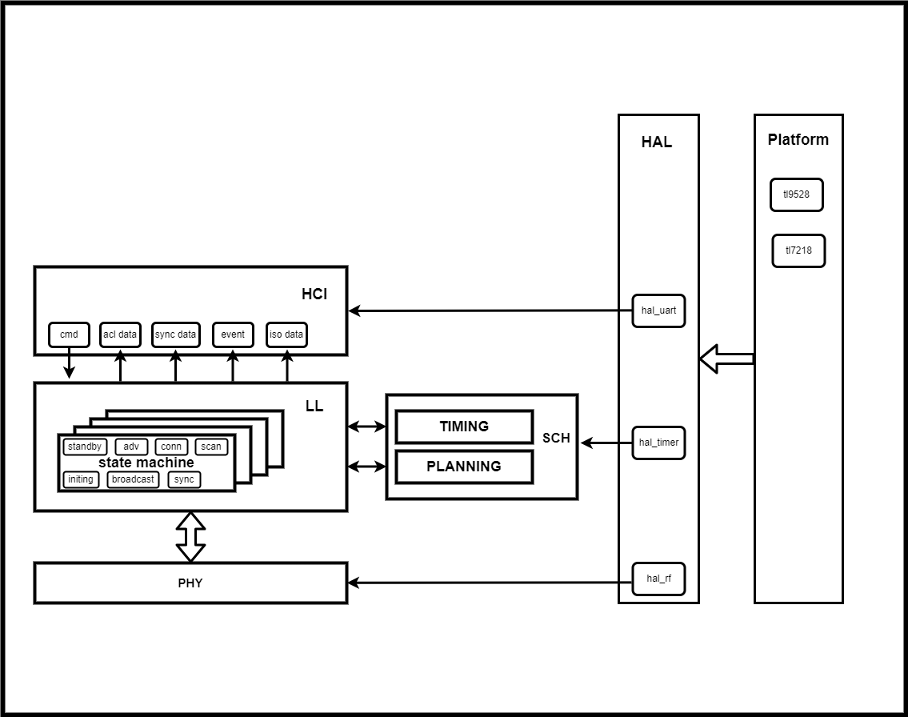

# HTX-低功耗蓝牙协议栈
## 写在前面
人生如此精彩，每天都能够一直体验新事物是无疑是一件很幸福的事情，做技术也是如此，重复性的工作总是使人怠惰，每天都充满挑战才会让人过的精彩，才能让生活充满乐趣。

低功耗蓝牙这项技术，截至目前为止，从事四年时间有余，开发这个BLE Controller的初衷没有任何商业化的目的，只是对这些年自己的所学做一个总结记录(或许我以后不再从事这个领域，也算是对自己这些年的努力有个交代，不留遗憾)，又算是一种让自己温故知新的一种方式，若干年后，等到自己老了，再回顾过往，能感到年华没有虚度，我是留下了一些东西的，那真是一件美好的事情。

在这四年，我经历过做项目，过认证，出SDK，干杂活出身，但庆幸的是，抓住了所有可能的机会，入门到熟悉再到如数家珍，度过的很快。这些年的经历让自己很有感触，努力做好每一件事，无论事情是大是小，你都需要有自己的思考，思考原理，架构，用途，发展方向，细节实现，或许过程会很艰辛，但只要你坚持到最后，你一定会感到很有趣的。

我把对BLE Controller的实现分为几部分，基础模块包括时序调度，时序规划。协议包括HCI,PHY,LL等。其中LL又包含广播，扫描等部分，如下图

## 我对代码迭代和更新的理解

迭代是痛苦的，你要不停的否定之前的自己，并要在其间找到新的方向，实现新的架构，但优秀来自于不满足，不将就，不甘心。迭代和更新正式软件的生命力所在，没有一份代码是完美的，但代码可以在迭代更新种不断完善，逐步在深度和广度，效率和空间，扩展性和普适性之间取得平衡，变得更加高效，更加稳定，更加易用。

那么什么时候应该进行代码迭代呢？据我的经验和经历，在以下情况时，可以进行代码迭代
1. 对于特定功能，你有了新的想法，新的实现方式，可以使得当前代码效率更高，所耗空间更小。
2. 你的代码需要进行功能扩展，同时旧的代码架构不满足新功能的嵌入。
3. 当你的代码问题频发，bug太多，这种情况要么是逻辑不够完善，要么是架构与当前代码所要实现的功能不匹配，都需要进行代码迭代。

## 协议栈框架

协议栈实现了标准的Bluetooth HCI和BLE LL

Bluetooth HCI具有较强的框架性，整体代码精简，实现清晰高效，占用空间较小，具有较强的可扩展性和可移植性。

Bluetooth LL支持多状态机的实现，支持多状态的自由组合，在时序和频带允许的情况下不受限制。

## 时序调度部分

时序调度主要分两部分，分别是时序调度和时序规划。

- **时序调度**

时序调度的核心目标是确保系统内所有任务均能在规定时限内执行。对于 BLE 协议栈而言，自 Core 5.0 版本起，对多状态机实例的支持需求显著增强，这就要求系统具备多任务共存能力 —— 例如同时支持两个 ACL 从机（Peripheral）或多个 ACL 主机（Central），由此催生了对时序调度模块的硬性需求。

从本质上讲，时序调度是对时间资源与射频带宽的高效统筹。一套优秀的时序调度系统，不仅能满足多任务并行运行的需求，还能最大限度降低自身资源消耗（包括算力与存储空间）。

- **时序规划**

时序规划的核心目标是：针对系统内锚点可变的周期性任务，通过统筹协调确保任务间互不冲突，从而提升系统整体的任务执行效率。

时序规划分为静态规划和动态规划两类：

静态规划适用于时序固定的周期性任务，如 BLE 协议中的 ACL、CIS、BIS、PDA 等。这类任务的特征是：一旦初始锚点、执行间隔及任务时长确定后，其后续时序便保持固定，不再发生变更。

动态时序规划则适用于时序非固定的周期性任务，例如 BLE 协议中的 ADV（广播）和 EXT ADV（扩展广播）。这类任务虽具有周期性，但每次执行的锚点可灵活调整，能根据系统当前的时序状态和带宽资源进行动态适配。

### 时序调度

时序调度模块将任务分为三类，分别是

- periodic task:周期性任务，在任务开始之后，会按照一定周期持续执行
- sporadic task：突发性任务，只执行一次
- asap task：As soon as possible，尽可能占用带宽类型的任务。

时序调度模块，将每个任务虚拟成一个节点，该节点具有下述特性(简述)

- anchor point
- interval
- duration
- start latency
- stop latency
- callback
- priority

### 时序规划

#### 静态时序规划

#### 动态时序规划

## BLE HCI

## BLE Controller

### BLE Phy

### BLE Packet

### LL

#### BLE Standby

#### BLE Advertising

#### BLE Connection

##### BLE Central
##### BLE Peripheral

#### BLE Scanning

#### BLE Initiating

#### BLE Synchronization

#### BLE Broadcasting

