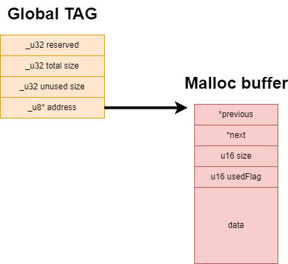
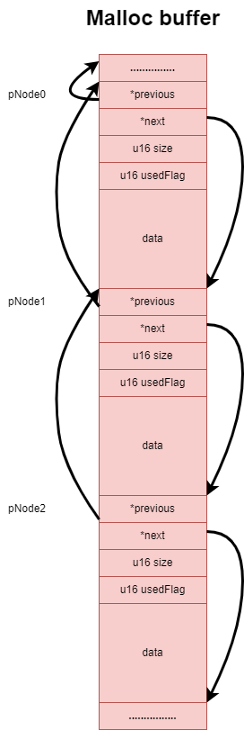
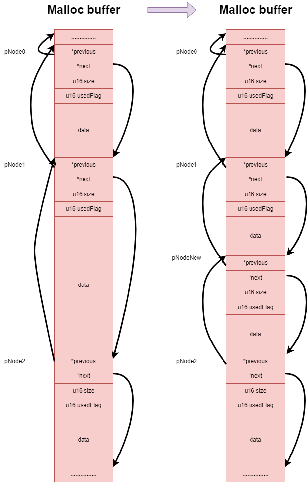
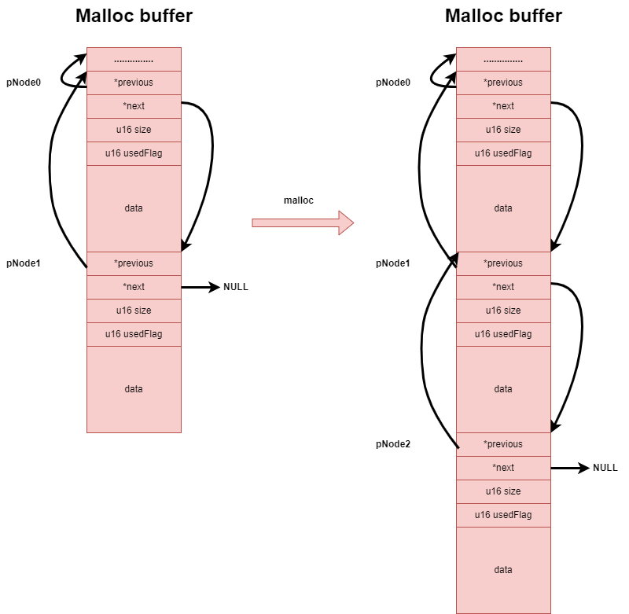
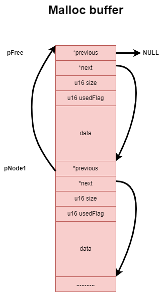
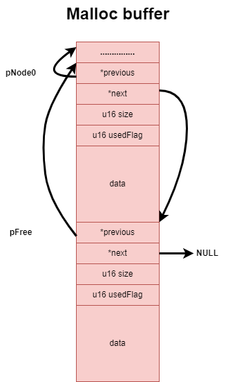
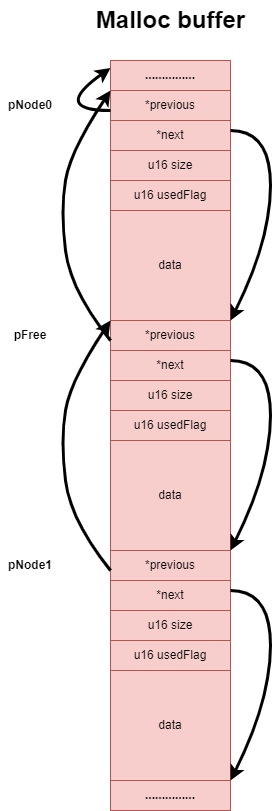

# module
根据自己的使用习惯，写了几个通用模块，例如malloc，heap，queue等模块

## malloc module
malloc整体设计为：

其中Global为malloc全局tag，其*address指向malloc buffer，malloc buffer的大小由用户指定。
malloc buffer的结构为：指向前一个结点的指针*previous，指向后一个节点的指针*next，当前节点的大小，以及当前节点是否可用usedFlag

### malloc
malloc时，分为两种情况，在节点尾部分配以及在节点之间分配
#### 在已存在节点之间分配
在已存在节点之间分配，为了使得内存利用率最大化，又存在两种情况
#### 当前节点刚好满足要求

malloc时发现pNode1可用，则直接将usedFlag置起，其余都不需要修改，这种情况通常发生在pNode1被free掉后，下次malloc进来发现合法

#### 当前节点的Size大于所需要内存空间

为了内存空间利用最大化，此时需要在原有节点基础上生成新的节点

#### 在所有节点尾部分配

malloc发现，遍历到所有节点结尾才发现可用，下一个节点指向了NULL，此时malloc时需要占据节点pNode1，重新生成空节点pNode2.

### free
free时，分为几种情况
**（1）** 前节点为NULL，此时需考虑后节点是否为空，即是否需要合并后节点

**（2）** 后节点为NULL，此时需要考虑前节点是否为空，即是否需要合并前节点

**（3）** 前后节点都非空，此时既需要判断前节点是否为空，又需要判断后节点是否为空，即是否需要合并前后节点。

 