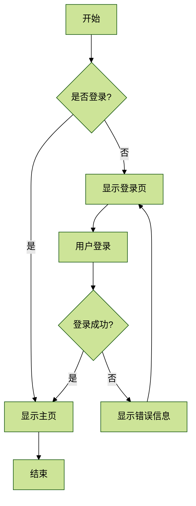
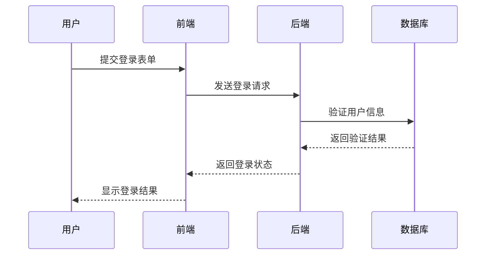
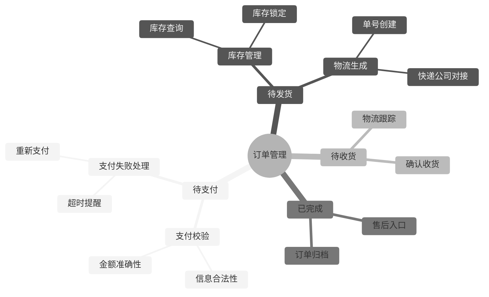
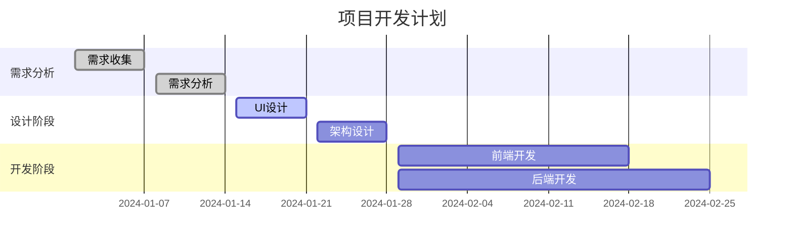
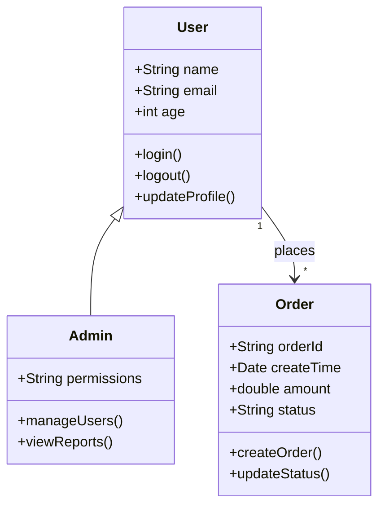
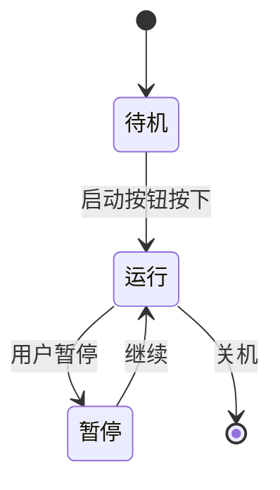
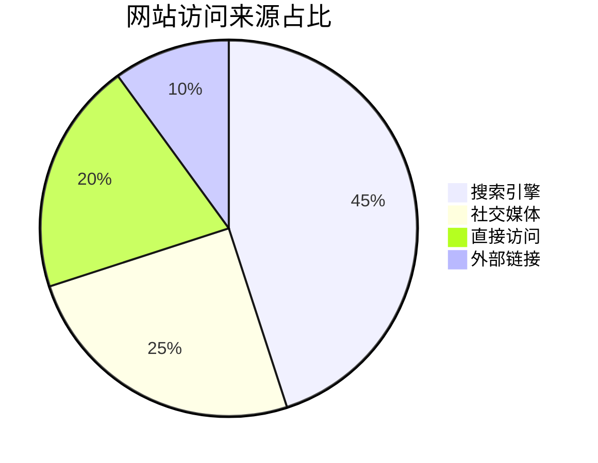

mermaid学习网站https://tooltool.net/zh/mermaid

https://mermaid.npmjs.net.cn/config/theming.html

流程图

```mermaid
%%{
  init: {
    "theme": "forest",
    "fontFamily": "monospace",
    "logLevel": "info",
    "flowchart": {
      "htmlLabels": true,
      "curve": "basis"
    },
    "sequence": {
      "mirrorActors": true
    }
  }
}%%
graph TD
    A[开始] --> B{是否登录?}
    B -->|是| C[显示主页]
    B -->|否| D[显示登录页]
    C --> E[结束]
    D --> F[用户登录]
    F --> G{登录成功?}
    G -->|是| C
    G -->|否| H[显示错误信息]
    H --> D
```

时序图

```mermaid
sequenceDiagram
    participant 用户
    participant 前端
    participant 后端
    participant 数据库
    
    用户->>前端: 提交登录表单
    前端->>后端: 发送登录请求
    后端->>数据库: 验证用户信息
    数据库-->>后端: 返回验证结果
    后端-->>前端: 返回登录状态
    前端-->>用户: 显示登录结果
```

思维导图

```mermaid
%%{
  init: {
    "theme": "neutral",
    "fontFamily": "monospace",
    "logLevel": "info",
    "flowchart": {
      "htmlLabels": true,
      "curve": "basis"
    },
    "sequence": {
      "mirrorActors": true
    }
  }
}%%

mindmap
  root((订单管理))
    待支付
      支付校验
        信息合法性
        金额准确性
      支付失败处理
        超时提醒
        重新支付
    待发货
      库存管理
        库存查询
        库存锁定
      物流生成
        单号创建
        快递公司对接
    待收货
      物流跟踪
      确认收货
    已完成
      订单归档
      售后入口

```

甘特图

```mermaid
gantt
    title 项目开发计划
    dateFormat  YYYY-MM-DD
    section 需求分析
    需求收集           :done,    des1, 2024-01-01,2024-01-07
    需求分析           :done,    des2, 2024-01-08,2024-01-14
    section 设计阶段
    UI设计            :active,  des3, 2024-01-15,2024-01-21
    架构设计          :         des4, 2024-01-22,2024-01-28
    section 开发阶段
    前端开发          :         des5, 2024-01-29,2024-02-18
    后端开发          :         des6, 2024-01-29,2024-02-25

```

类图

```mermaid
classDiagram
    class User {
        +String name
        +String email
        +int age
        +login()
        +logout()
        +updateProfile()
    }
    
    class Admin {
        +String permissions
        +manageUsers()
        +viewReports()
    }
    
    class Order {
        +String orderId
        +Date createTime
        +double amount
        +String status
        +createOrder()
        +updateStatus()
    }
    
    User <|-- Admin
    User "1" --> "*" Order : places
```

状态图

```mermaid
stateDiagram-v2
    [*] --> 待机
    待机 --> 运行 : 启动按钮按下
    运行 --> 暂停 : 用户暂停
    暂停 --> 运行 : 继续
    运行 --> [*] : 关机
```

饼图

```mermaid
pie
    title 网站访问来源占比 
    "搜索引擎" : 45       
    "社交媒体" : 25
    "直接访问" : 20
    "外部链接" : 10
```

